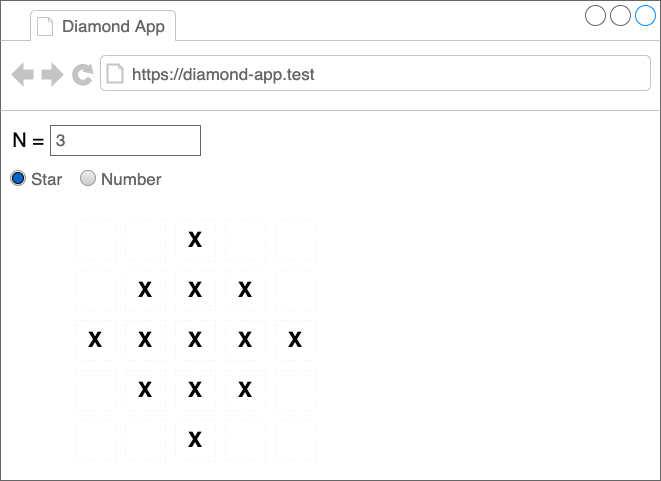
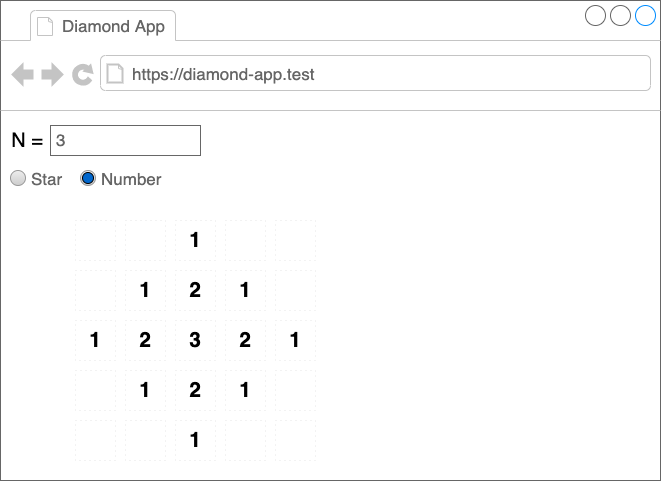

# โปรแกรมวาดสี่เหลี่ยมข้าวหลามตัด (Diamond App)

## ภาพรวม

บททดสอบชิ้นนี้ มีจุดมุ่งหมายเพื่อเรียนรู้เพิ่มเติมเกี่ยวกับทักษะของผู้สมัครในด้าน :
- `Problem Solving`
- `Computer Programming Fundamental`

ผู้สมัครสามารถตรวจสอบว่า `ข้อกำหนด` ที่มีมาให้นั้น\
ทำความเข้าใจและชัดเจนพอที่จะลงมือทำได้หรือไม่

## สำคัญมาก

> **ผู้สมัครมีอิสระในการปรับเปลี่ยนต้นแบบหรือเอาต์พุตตามความถนัด\
> แต่ต้องยังคงแนวความคิดของการมอบหมายงานไว้**

>แบบทดสอบนี้เป็นแบบทดสอบที่ใช้ระหว่างการ interview ลักษณะ `mob/pair-programming`\
>หากผู้สมัครมีข้อสงสัย หรือ ไอเดีย หรือ ต้องการสื่อสารอะไรเพิ่มเติ่มเกี่ยวกับแบบทดสอบ \
>`สามารถสอบถามได้ตลอดเวลา` โดยเปรียบเสมือน __ผู้สมัครกำลังนั่งทำงานอยู่ในวันทำงานปกติ__

## ข้อกำหนด (Requirements)

ให้ `N` เป็นข้อมูลที่รับเข้ามาเพื่อทำการวาด `สี่เหลี่ยมข้าวหลามตัด` หรือ `เพชร` บนเวปเพจได้\
โดยสามารถเปลี่ยนแปลงการวาดได้ 2 รูปแบบคือ
- วาดโดยแสดงเป็น `*`
- วาดโดยแสดงเป็น `ตัวเลข`

## ตัวอย่าง (Prototype)

### วาดโดยแสดงเป็น `*`

### วาดโดยแสดงเป็น `ตัวเลข`

